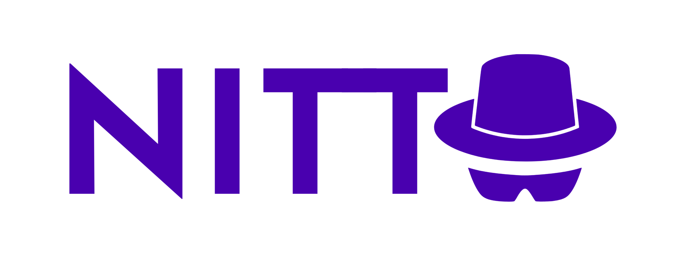
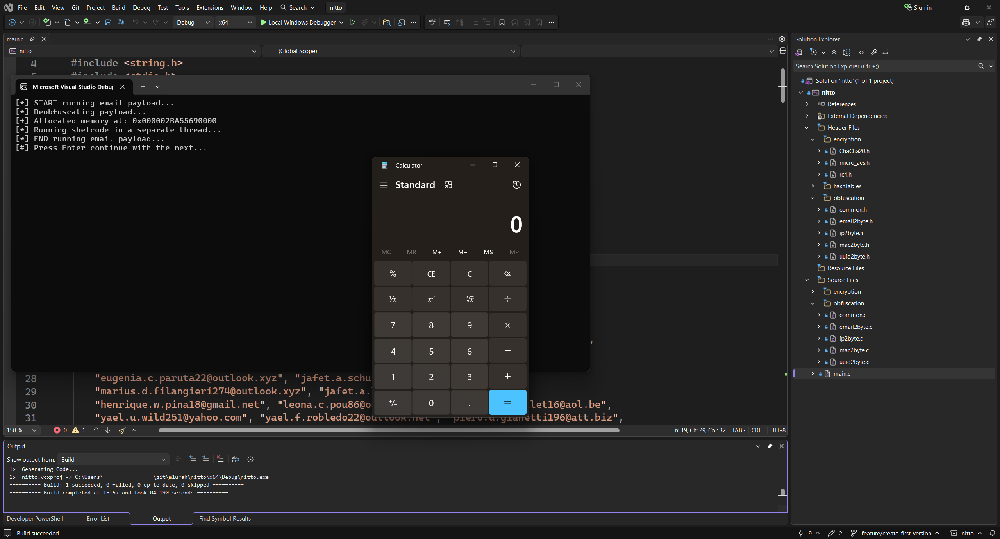
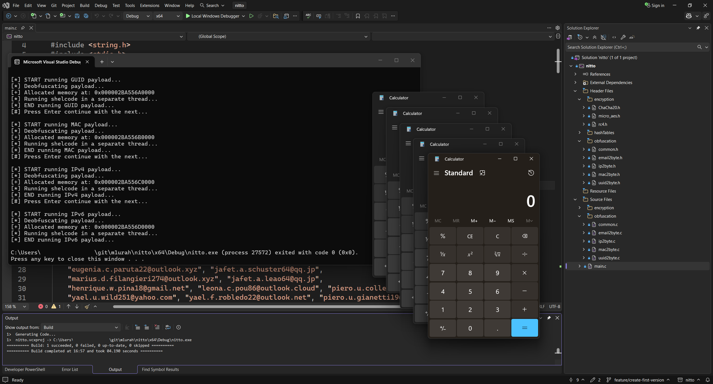
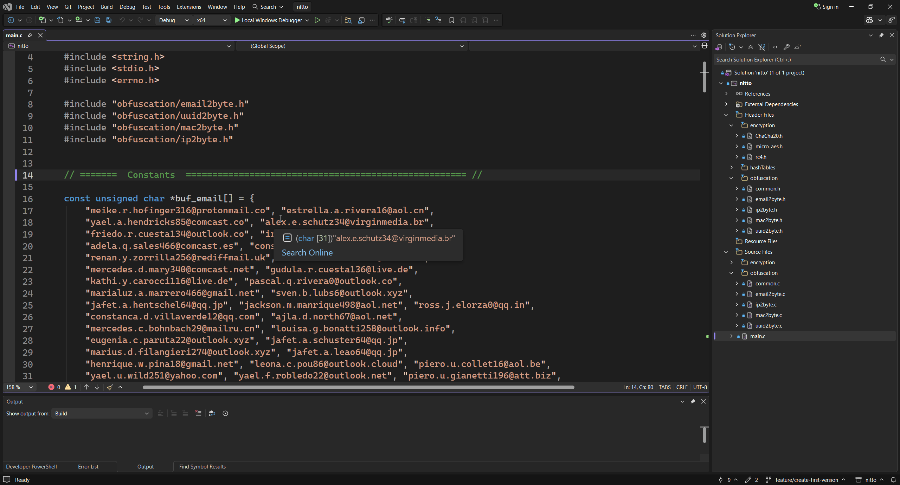

# Nitto

A simple tool to evade signature-based AV detection **in Windows** by applying encryption or obfuscation to your payloads.

The repo is organized into two different *modules*:

- **Python script**, that transforms the binary payloads into its obfuscated/encrypted form.
- **C code**, that implements custom deobfuscation and decryption functions to evade static analysis of WinAPI and NTDLL calls.

Nitto implements a **novel\* obfuscation technique** that I created myself: **email-based obfuscaton**, which converts 6-byte payloads into emails of the form: `[first_name].[middle_initial].[last_name][number]@[domain].[tld]`.

\*I haven't seen any similar techniques used in the wild yet, hence the *novel* part.

The cool thing about this technique is that it makes it harder for LLM-assisted deoubfuscation tools at first glance. That said, if they extract the lookup tables from the PE (they must be bundled in there), they can eventually reverse it **with enough** context (of course). But honestly, that applies to all other techniques too.

See the [Email-based obfuscation](#email-based-obfuscation) section for more info.



## Table of Contents

- [Remarks](#remarks)
- [Overview](#overview)
  - [Usage (concise)](#usage-concise)
  - [Project Structure](#project-structure)
  - [Code Structure](#code-structure)
    - [C Code](#c-code)
    - [Python Code](#python-code)
- [Usage](#usage)
  - [Pre-requisites](#pre-requisites)
  - [Python Module](#python-module)
    - [Transforms, Operations, and Modes](#transforms-operations-and-modes)
    - [Input Data](#input-data)
    - [Output and Format](#output-and-format)
    - [Bundle Code](#bundle-code)
  - [C Module](#c-module)
    - [Local Build](#local-build)
- [Obfuscation](#obfuscation)
  - [Email-based Obfuscation](#email-based-obfuscation)
    - [Byte-to-alphanumeric conversion](#byte-to-alphanumeric-conversion)
    - [Lookup table-based conversion](#lookup-table-based-conversion)
  - [Custom C Deobfuscation](#custom-c-deobfuscation)
- [Encryption](#encryption)
- [Padding](#padding)
- [Logging Format](#logging-format)
- [Wishlist](#wishlist)
- [License](#license)

## Remarks

- First, please keep in mind that the main purpose of developing this tool was purely educational (yeah, I coded it myself). You'll probably find plenty of stuff that could be improved or refactored, so be my guest ;)

- It goes without saying, but this tool is meant for legimitate security research and educational purposes only, not for malicous plans or activies.

- For the sake of simplicity, it is often assumed that the input parameters of the functions are well-defined, and that the user knows what they're doing. As a result, some specific error checks have been ommited. However, this doesn't mean that appropiate checks haven't been included where necessary, they have. If you intend to use my code in a live environment make sure to double check it, specially when dealing with memory allocations and [POINTERS](./images/lovely_pointers.png)!!

- The bundled C encryption libraries include custom implementations of the cipher algorithms used in the Python module, written by very capable devs. Eventhough they claim it's RFC-whatever compliant, and not that I don't trust them (≖_≖), be aware that most security professionals strongly advise against using custom ciphers implementations, AND FOR GOOD REASON! Use it for learning, experimenting, or even for your own payloads, but not for classified plans to invade Mars... although, I'd be interested to get to know more about that.

- If you like what you see, I have a blog! Check it out at [allthingsmalware.com](https://allthingsmalware.com)

## Overview

Nitto (short for incog**nito**) *mainly* refers to the python script, and transforms a payload using **one of two modes**:

- **Encryption**: supports for ciphers (AES, ChaCha20, RC4, and XOR) with different modes of operation
- **Obfuscation**: converts the payload into a list of IP, MAC, UUID, or email strings

It takes the bytes from stdin, a file in the system, or an simple string and perform the required transformation.

The **Python code** implements the obfuscation and encryption, while the **C code** implements the **de**obfuscation and **de**cryption, and a sample application demonstrating each obfuscation technique. See the [C Module usage](#c-module) section to see how to run it.

### Usage (concise)

For **encryption**:

```shell
nitto -t encryption --op aes -i input.bin
```

which will use AES with the following default values:

- GCM as the mode of operation
- 256 as the key size

They key and nonce will be printed to stdout.

Use `nitto -l ops` or `nitto -l modes` to see the defaults.

For **obfuscation**:

```shell
echo "Hello World!" | nitto -t obfuscation --op email
```

which will transform the `Hello World!` string into its "email form", based on the lookup tables present under `scripts/helpers/wordLists`.

> Note that nitto here refers to both `nitto.exe`, and the `python .\scripts\transformations\main.py` commands.

I used two different input methods (`-i` arg and piping) above on purpose, any input method works with any transform. For more info, see the [Usage](#usage) section.

### Project Structure

The repo is structured as follows:

```plaintext
.
├── include/
│    ├── encryption/    # Encryption headers
│    ├── hashTables/    # Hash tables for obfuscation
│    └── obfuscation/   # Obfuscation headers
├── scripts/
│    ├── helpers/       # Word lists and word list generator
│    └── transformer/   # Python transformation logic
├── src/
│    ├── main.c
│    ├── encryption/    # Encryption implementations
│    └── obfuscation/   # Obfuscation implementations
├── images/             # Project images
├── licenses/           # Boring stuff
├── nitto.*             # Visual Studio stuff
├── LICENSE
├── Makefile            # Build script for C module (doesn't exist yet)
└── README.md           # This file ;)
```

### Code Structure

C and python code files have different purposes as we already saw, and as such, they are organized "differently".

One thing that they share in common is that all code files are organized into "sections" marked by `# =======  <Section>  ===...` dividers (`//` instead of `#` for C code).

#### C Code

Lives under two dirs:

- `include/`: for headers
- `src/`: for the actual files

and it's structured into:

- The `main.c` file: contains a sample implementation of the 4 main obfuscation tecniques
- `encryption/`: AES, ChaCha20, RC4, and XOR implementations
- `obfuscation/`: deobfuscates IP, MAC, UUID/GUID, or email lists into its binary representation

#### Python Code

Under `scripts/transformer` we have:

- The `main.py` file
- `transformations`: obfuscation and encryption logic
- `utils`: stuff that is used across different parts of the program, like the custom metasploit-like logger and the I/O functionality

## Usage

The modules under Nitto are intended to be used in tandem:

1. Use the python script to generate the transformed payload
2. Integrate the necessary files from the C implementation into your codebase to perform the reverse operation

For example, if we obfuscate a payload using the IP mode, `ip2byte.c` and `ip2byte.h` must be included into our code so that the payload can be restored to its original value.

### Pre-requisites

The following **requirements** must be either installed or available in your **Windows machine**:

1. python 3.11+ (might work with older versions, haven't tested it)
2. A [python venv](https://docs.python.org/3/library/venv.html#:~:text=On%20Windows%2C%20invoke%20the%20venv%20command%20as%20follows)
3. Packages from the `requirements.txt` file(s) installed into the venv
4. (Optional) [gperf](https://www.gnu.org/software/gperf/#TOCdownloading) if you want to re-create the lookup tables (i.e. run `wordListGenerator.py`)

If you want to run the C code demonstration as well, you have two options:

1. Use Visual Studio
2. Compile it using the `Makefile` and run it

> **NOTE**. I haven't created the Makefile yet. Will update this once that happens.

For the latter, you need to install:

- `gcc` compiler, see [MSYS2](https://www.msys2.org/) for install instructions
- `Make` tool
- [Windows SDK](https://learn.microsoft.com/en-us/windows/apps/windows-sdk/downloads) (bundled with Visual Studio)

### Python Module

The basic syntax is:

```shell
nitto -t <TRANSFORM> --op <OPERATION> [-m <MODE>] [-o <OUT>] [-f <FORMAT>]
```

#### Transforms, Operations, and Modes

As said, there are two types of transforms (`-t`): `encryption` and `obfuscation`. Each transforms has:

- **Operations** (`--op`): the specific action to perform
- **Modes** (`-m | --mode`): variations for each operation

Before running a transform, you can list all available opertaions, modes, and defaults using:

```shell
nitto -l
# or
nitto -l all
```

#### Input Data

Nitto can take bytes from **stdin**, a **file**, or a **simple string**. There are **three ways to provide input data**:

- **Input parameter**: `nitto -t obfuscation --op email -f python -i input.txt`
- **Redirection**: `cmd /c "nitto -t obfuscation --op email -f python < input.txt"`
- **Pipes**: `echo "This is an example string, hello wolrd!" | nitto -t obfuscation --op ip -m ipv4 -f c`

Pipes work both for strings and stdin data.

#### Output and Format

- **Output file**: by default, result is printed to stdout. If `-o | --out <OUT>` is provided, writes the result to a file.
- **Format**: use `-f | --format <FORMAT>` to specify the target language (`c` or `python`). Defaults to `c`.

#### Bundle Code

To bundle all python code and its dependencies into a single package manually, run:

```powershell
pyinstaller --noconfirm --onedir --console `                         
  --add-data "scripts/helpers/wordLists;scripts/helpers/wordLists" `
  --add-data "scripts/transformer/transformations;transformations" `
  --add-data "scripts/transformer/utils;utils" `
  -n nitto scripts/transformer/main.py
```

or

```powershell
pyinstaller .\nitto.spec
```

from the root directory. This will create the `dist/nitto/nitto.exe` executable.

### C Module

On Visual Studio just click **Run** and the program will run, displaying the sample deobfuscation results for all 4 techniques.

First iteration:



Click **Enter** to continue with the execution. After 4 **Enter**s, the program will finish:



Full flow:



#### Local Build

To build the code, simply run:

```shell
make
```

The `nitto.exe` will be placed on the root directory. Run it like so:

```shell
./nitto.exe
```

## Obfuscation

Nitto implements 4 types of obfuscation techniques that convert the raw bytes into their IP, UUID, MAC, or email string representations.

The IPfuscation technique and its variants (MAC and UUID) are not new, they have been around since early 2021. What's interesting about these techniques is the use of Windows System DLLs (like `Rpcrt4.dll` or `Ntdll.dll`) functions to reconstruct the shellcode:

- `RtlIpv4AddressToStringA`
- `RtlIpv6AddressToStringA`
- `UuidFromStringA`

However, most modern EDRs now monitor for high volumes of these "string-to-binary" API calls, specially when followed by memory allocation functions like `VirtualAllow` or `WriteProcessMemory`. Hence the need to implement custom code that can perform that same translation. See the [Custom C Deobfuscation](#custom-c-deobfuscation) section.

### Email-based Obfuscation

This is a new technique that I've developed. While other obfuscation techniques converts each byte to their decimal (IPv4) or hexadecimal (IPv6, MAC, and UUID) representation, this doesn't apply to emails. Email addresses valid characters are limited to alphanumeric (a-z, 0-9), periods (not at the stard/end or consecutively), underscores, hyphens, and plus signs. Eventhough spaces and other special characters (`(),:;<>@[\\]`) are considered valid per [the correspending RFC rules](https://en.wikipedia.org/wiki/Email_address#Local-part), they are **generally discouraged** or even disallowed. Such restrictions prevent us from doing a direct byte-to-ascii conversion.

Let's say we have the following bytes sequence: `\xfc\x48\x83\xe4\xf0\xe8\xc0\x00\x00\x00\x41\x51\x41\x50`, which refers to the *standard* bootstrap header for x64 Windows shellcode that aligns the stack and prepares the CPU for further instructions. Many of these bytes represent non-printable controls or non alphanumeric characters: `\xfc`=`ü`, `\xc0`=`À`, `\x83`=(Non-printable/Extended ASCII), `\x00`=(Null control character), etc. Meaning they **can't be converted** into ASCII characters **without losing information**.

Enter two different email-obfuscation approaches, each with its own pros and cons:

1. **Byte-to-alphanumeric conversion** (not developed yet): converts a given byte into it's alphanumeric representation.
2. **Lookup table-based conversion**: uses bit-level partitioning and lookup tables to convert payload bytes into real looking email components without losing information.

Method one is more compact and data-preserving but results are not realistic, not by far. Method two produces larger, but legitimate-looking email addresses.

#### Byte-to-alphanumeric conversion

This method priotizes data preservation and lower-byte count over realism.

1. Iterate through each byte:
   - If byte represents a lowercase letter (a-z, `\x61`-`\x7a`), use the character directly <-- or use uppercase letters too if treating emails as case-sensitive
   - Otherwise, convert to decimal representation
   - ASCII digit bytes (`\x30`-`\x39`) are used as-is, not converted to numbers, i.e. `\x30` = `60`, and not `0`
2. Organize bytes into variable-sized emails (4-10 bytes for each) and join numbers (not letters) with periods, hypens, or underscores to create a pseudo-realistic local part
3. Append `@domain.tld` to form the email address

**Example** with:

```shell
\xfc\x48\x83\xe4\xf0\xe8\xc0
\x00\x00\x00\x41\x51\x41\x50
\x52\x51\x56\x48\x31\xd2\x65
\x48\x8b\x52\x60\x48\x8b\x52
```

Byte conversions used:

```plaintext
\xfc -> 252    \x48 -> H      \x83 -> 131    \xe4 -> 228    \xf0 -> 240
\xe8 -> 232    \xc0 -> 192    \x00 -> 0      \x00 -> 0      \x00 -> 0
\x41 -> 65     \x51 -> 81     \x41 -> 65     \x50 -> 80     \x52 -> 82
\x51 -> 81     \x56 -> 86     \x48 -> H      \x31 -> 1      \xd2 -> 210
\x65 -> e      \x48 -> H      \x8b -> 139    \x52 -> 82     \x60 -> 96
\x48 -> H      \x8b -> 139    \x52 -> 82
```

Result (pseudo-random variable-size email):

- `252h_131.228@gmail.com`
- `240-232_0.65_81.65.80_82@yahoo.com`
- `81_86.h1.210e_h139@gmail.com`
- `82.96_h139.82@outlook.com`

We went from 14 bytes to 109.

Note that:

- most bytes produce 2-3 digit numbers due to shellcode entropy
- not many lowercase letters
- result looks less realistic, but contain more data in less space (i.e. bytes)

#### Lookup table-based conversion

This method priotizes realism by using pre-computed tables of common names, domains, and TLDs.

1. Divide the payload into 6-byte (48-bit) blocks, pad if needed
2. Partition each 48-bit block into 6 chunks:
   - 12 bits  (0-4095 idx)  -> first names table  (example `john`)
   - 5 bits   (0-31 idx)    -> middle initials    (example `.j`)
   - 12 bits  (0-4095 idx)  -> last names table   (example `.doe`)
   - 9 bits   (0-511 idx)   -> number (0-511)     (example `27`)
   - 5 bits   (0-31 idx)    -> domains table      (example `@gmail`)
   - 5 bits   (0-31 idx)    -> TLDs table         (example `.com`)
3. Convert each chunk to its decimal representation to use as a lookup index. For example: `000000011011` (binary) = 27 (decimal) -> index into firstNames table
4. Lookup each index in its table to retrieve the component
5. Concatenate: `[first_name].[middle_initial].[last_name][number]@[domain].[tld]`

**Example** with:

```shell
\xfc\x48\x83\xe4\xf0\xe8\xc0
\x00\x00\x00\x41\x51\x41\x50
\x52\x51\x56\x48\x31\xd2\x65
\x48\x8b\x52\x60\x48\x8b\x52
```

Result:

- **Block 1**: `\xfc\x48\x83\xe4\xf0\xe8` -> `james.r.patricia523@gmail.com`
- **Block 2**: `\xc0\x00\x00\x00\x41\x51` -> `robert.d.michael891@yahoo.net`
- **Block 3**: `\x41\x50\x52\x51\x56\x48` -> `elizabeth.m.thomas216@outlook.org`
- **Block 4**: `\x31\xd2\x65\x48\x8b\x52` -> `christopher.a.jennifer634@protonmail.io`
- **Block 5**: `\x60\x48\x8b\x52\x02\x02` -> `david.j.sarah127@zoho.com`

The last block was missing 2 bytes and was padded, see [Padding](#padding) section.

We went from 14 bytes to 155.

### Custom C Deobfuscation

All deobfuscation logic lives under the C module, i.e. inside `src/` and `include/` directories.

Instead of using WinAPI or NTDLL calls, I've decided to implement my own functions for two reasons:

1. These obfuscation techniques are mostly 4 years old, except the email-based one. As such, EDRs have caught on and they now monitor for high volumes of these "string-to-binary" API calls, especially when in combination with other functions known to be used by malware. If these DLLs are not loaded, we are *less likely* to get detected
2. As mentioned multiple times already, I mainly created this tool to improve my coding and maldev skills

Custom functions:

- [RtlIpv6StringToAddressA](https://learn.microsoft.com/en-us/windows/win32/api/ip2string/nf-ip2string-rtlipv6stringtoaddressa) -> `Ipv6StringToAddress`
- [RtlIpv4StringToAddressA](https://learn.microsoft.com/en-us/windows/win32/api/ip2string/nf-ip2string-rtlipv4stringtoaddressa) -> `Ipv4StringToAddress`
- [RtlEthernetStringToAddressA](https://learn.microsoft.com/en-us/windows/win32/api/ip2string/nf-ip2string-rtlethernetstringtoaddressa) -> `EthernetStringToAddress`
- [UuidFromStringA](https://learn.microsoft.com/en-us/windows/win32/api/rpcdce/nf-rpcdce-uuidfromstringa) -> `UUIDFromString`
- `EmailStringToBytes` implements the email lookup table-based obfuscation

The `.h` files explain each function in detail.

## Encryption

As mentioned in the [Remarks](#remarks) section, using custom cipher implementations is usually discouraged, and that's exactly why I'm using them. Jokes aside, the main objective of this project wasn't to re-invent the cipher wheel, but rather improve my skills and get to know how obfuscation really works at a *lower* lvl. Don't get me wrong, encryption is also really useful for masquerading one's actions, but implementing the ciphers from scratch would'be taken me far too long, and the results would probably have been much worse than just getting battle-tested implementations.

This project uses the standalone `.c` and/or `.h` files from the following projects:

- [ChaCha20](https://github.com/marcizhu/ChaCha20)
- [micro-AES](https://github.com/polfosol/micro-AES)
- [RC4](https://github.com/openssl/openssl): modified to remove OpenSSL dependencies for standalone compilation

## Padding

Padding is commonly used for encryption, and it means adding data to a message prior to the transformation so that the plaintext meets specifics length requirements. In our case, padding is used only for obfuscation, as all the ciphers used in encryption **don't need it**.

Each obfuscation technique divides the payload into byte-sized blocks:

- **IPv4**: 4 bytes
- **IPv6**: 16 bytes
- **UUID**: 16 bytes
- **MAC**: 6 bytes
- **Email** (lookup-based): 6 bytes

If the input data isn't multiple of the block size (e.g. 16 bytes for UUID), padding must be added to adjust its length. We'll use the [PKCS#7](https://en.wikipedia.org/wiki/PKCS_7) algorithm for that.

- If `N` is the number of bytes in a block and `M` bytes (`N` < `M`) are missing from the last block, it adds the character `0xM` (hexadecimal) `M` times at the end.
- **Important**: PKCS#7 always add padding. If the plaintext is already multiple of `M` bytes, it adds the `0xM` character `M` times.

To remove the padding, we simply deobfuscate the data, get the last byte (`0xM`) to retrieve the padding, and remove the last `M` bytes.

## Logging Format

A set of symbols is used to indicate status:

- `[*]` info or progress
- `[+]` success
- `[-]` error
- `[!]` warning or smth unexpected
- `[#]` user input required

## Wishlist

All the stuff that I want to implement in the near future:

- [ ] Create Makefile
- [ ] Create pipeline to release versioned EXEs
- [ ] Implement EmailFuscation byte-to-alphanumeric conversion
- [ ] "Encryption first, then obfuscation" mode for the same payload
- [ ] Use multiple obfuscations at once for the same payload, to generate a real-like dictionary (or list) of data
- [ ] (Low priority) Implement `Strict == FALSE` in `Ipv4StringToAddress`

## License

MIT License (see `LICENSE`) — do what you want with it, just don't blame me.
